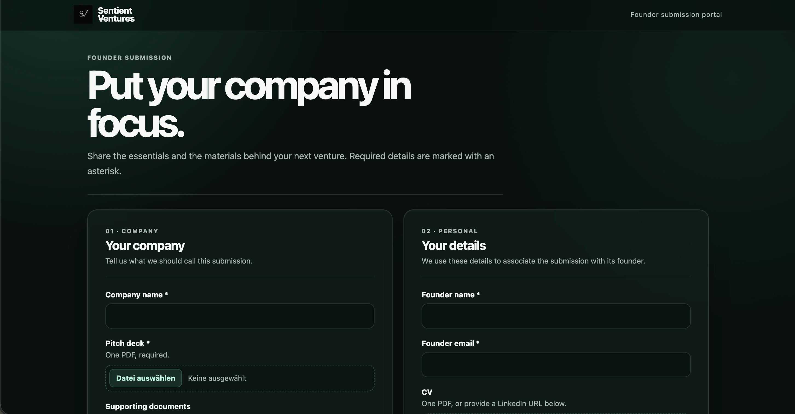
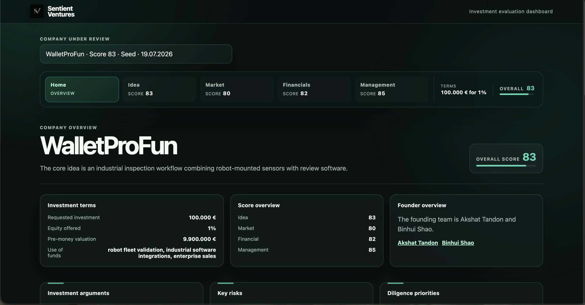
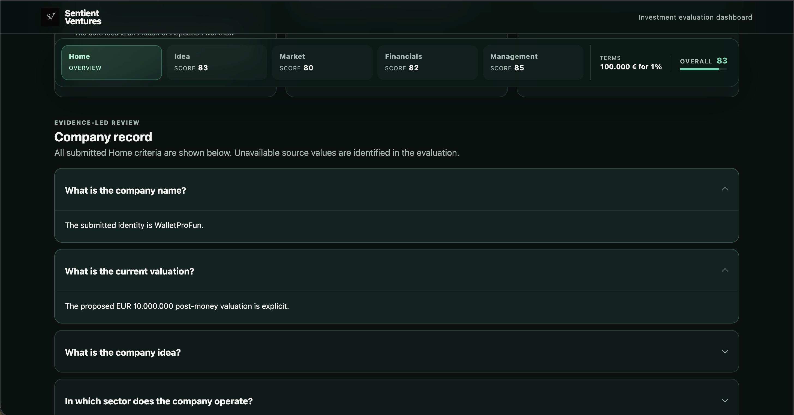
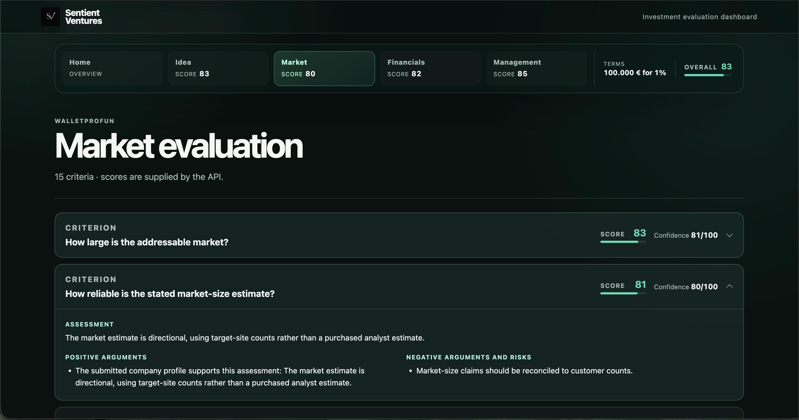
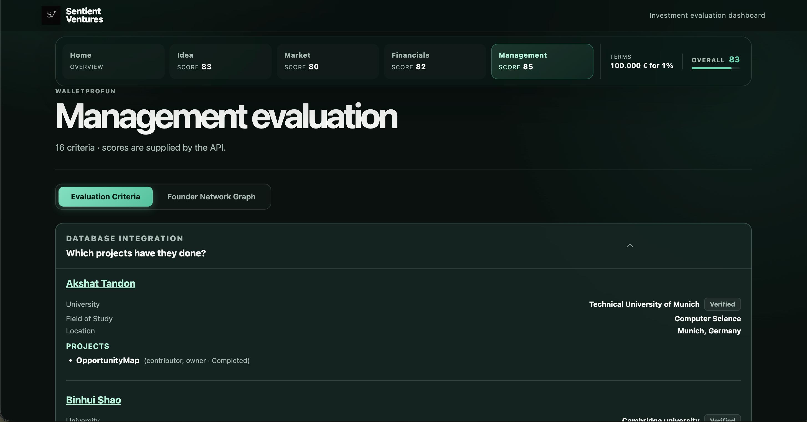
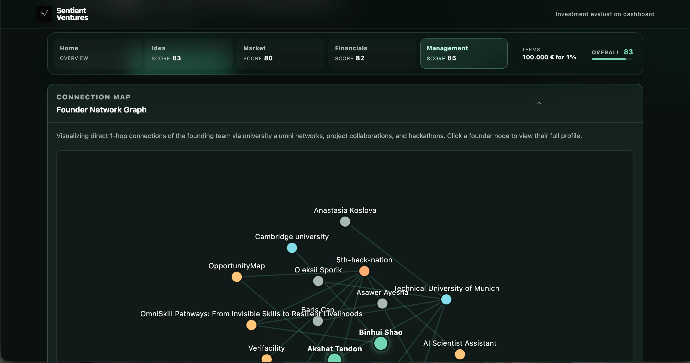
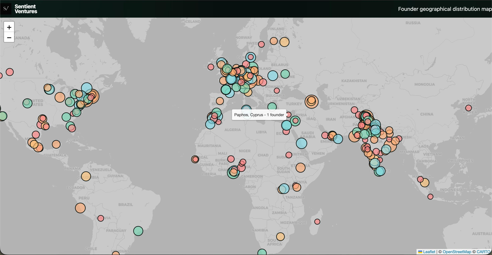
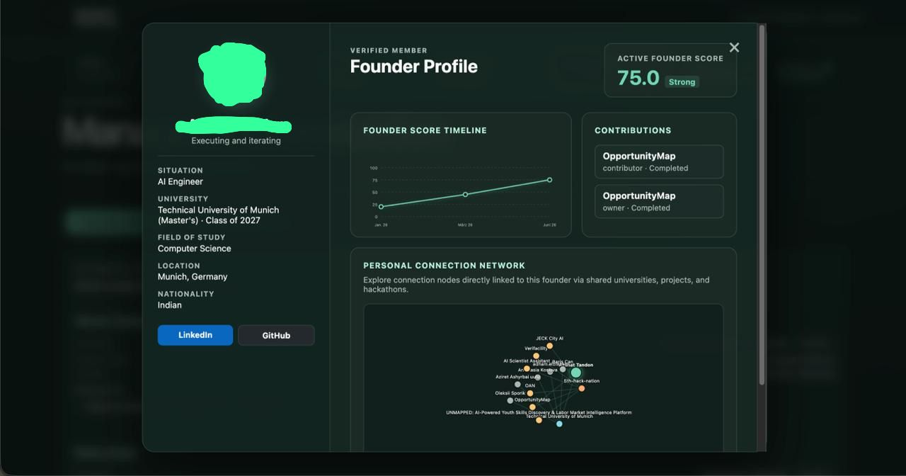

# SentientVentures

SentientVentures is a local-first venture intelligence platform that turns a founder submission into a structured, evidence-linked investment review. It combines pitch-deck and CV ingestion, a bounded LLM council, founder background verification, and relationship intelligence in one workflow for investors.

The platform is designed to make early-stage diligence easier to inspect: every company is assessed against a fixed 75-criterion registry, scored across Idea, Market, Financials, and Management, and presented with confidence, arguments, risks, missing information, and source references.

## Product tour

### Founder submission

Founders provide company details, a pitch deck, identity information, and supporting material through a focused submission portal.



### Investment overview

The investor dashboard brings the company thesis, proposed terms, category scores, founder overview, investment arguments, risks, and diligence priorities into one decision surface.



### Evidence-led company record

Submitted facts are organized into an expandable company record. Unavailable or unsupported values remain visible as missing information instead of being silently invented.



### Criterion-level market evaluation

Each criterion includes a score, confidence level, assessment, positive case, negative case, and supporting evidence so reviewers can inspect how the conclusion was reached.



### Founder and management verification

Management diligence cross-references founders with the local people database, including universities, fields of study, locations, and prior projects.



### Founder relationship intelligence

The interactive network graph exposes direct links between founders, alumni, collaborators, projects, and hackathons to surface relevant background and shared history.



### Geographic founder discovery

The world map groups founders by resolved city coordinates and scales locations using active founder scores. Investors can move from a map marker directly into a founder profile.



### Founder profile intelligence

Profiles combine verified background data, an active founder score and timeline, contributions, external links, and a personal connection network.



## How the service works

1. **Submit** — the founder portal accepts a pitch-deck PDF, founder details, a CV or LinkedIn URL, and optional supporting PDFs.
2. **Extract** — the FastAPI service validates uploads, extracts native PDF text, optionally falls back to OCR, and records provenance for each fact.
3. **Evaluate** — the LLM council reviews the evidence against 75 registered criteria across the company, idea, market, financial, and management views.
4. **Validate** — the API enforces strict schemas, score bounds, exact criterion coverage, and citation grounding before publishing any result.
5. **Investigate** — the dashboard connects the evaluation to founder records, prior projects, network relationships, and geographic distribution.

## LLM council

The council is a deliberately bounded **Pro / Contra / Judge** workflow:

- The **Pro analyst** identifies the strongest evidence-supported investment case.
- The **Contra analyst** identifies risks, contradictions, and missing information.
- The **Judge** reconciles both views and returns all 75 criteria in a strict schema.
- A single **repair pass** may correct an invalid response; results that still fail validation are rejected.

The model receives normalized fact records rather than unrestricted source documents. Published citations must exactly match recorded provenance, including the source document and page where available. Scores use a 1–100 scale and are withheld when criterion-specific evidence is insufficient. Server-owned fields such as company identity, source set, category, and publication time cannot be selected by the model.

Live processing currently supports the OpenAI Responses API when `SV_LLM_PROVIDER=openai` is configured. Without a valid provider, the worker fails closed at council preparation rather than fabricating an investment result. A deterministic no-network provider is available only for tests and explicit demo mode.

## Platform capabilities

- **Structured venture evaluation** across 75 versioned criteria
- **Evidence and page-level provenance** for published assessments
- **Investment terms and category scorecards** for rapid comparison
- **Founder background verification** against a local SQLite people graph
- **Project, university, alumni, and hackathon connections** in an interactive network
- **Geographic founder discovery** using a checked-in GeoNames-derived city lookup
- **Safe local persistence** with atomic publication and retryable processing jobs
- **Shared contracts** between the Python API and TypeScript applications

## Architecture

| Component | Port | Responsibility |
| --- | ---: | --- |
| Founder portal | `8080` | Submission form, uploads, and processing status |
| VC dashboard | `8081` | Company review, criterion detail, scores, evidence, and founder intelligence |
| Founder world map | `8082` | Geographic discovery and profile deep links |
| FastAPI service | `8000` | Validation, PDF extraction, council orchestration, persistence, and read APIs |
| `@sv/contracts` | — | Versioned schemas and generated TypeScript contracts |
| `@sv/ui` | — | Shared interface components |

Submission data is stored under `data/companies/<company-slug>/`, with separate directories for source documents, extracted facts, evaluations, and logs. The current system is intended for local use by trusted operators; authentication, a distributed queue, and a production database are not yet implemented.

## Getting started

### Prerequisites

- Conda
- Node.js 18 or newer
- pnpm 9

### Install

```bash
conda env create -f environment.yml
conda activate codex-agents
pnpm install
cp .env.example .env
```

To enable the live council, set the following values in `.env`:

```dotenv
SV_LLM_PROVIDER=openai
SV_LLM_MODEL=<supported-model>
OPENAI_API_KEY=<your-key>
```

Never place credentials in variables prefixed with `VITE_`; those values are exposed to browser code.

### Run the complete stack

```bash
pnpm dev
```

Open:

- Founder portal: <http://localhost:8080>
- VC dashboard: <http://localhost:8081>
- Founder world map: <http://localhost:8082>
- API documentation: <http://localhost:8000/docs>
- Health check: <http://localhost:8000/health>

## Validation

```bash
pnpm typecheck
pnpm test:web
pnpm test:contracts
conda run -n codex-agents pytest
pnpm test:e2e
```

## Data attribution

Founder locations use a lookup derived from the [GeoNames `cities500` data dump](https://download.geonames.org/export/dump/), licensed under [CC BY 4.0](https://creativecommons.org/licenses/by/4.0/). Refresh it with:

```bash
python scripts/generate_location_coordinates.py --geonames-zip /path/to/cities500.zip
```

## Documentation

- [Architecture](docs/architecture.md)
- [Operations](docs/operations.md)
- [Evaluation Markdown contract](docs/markdown-contract.md)
