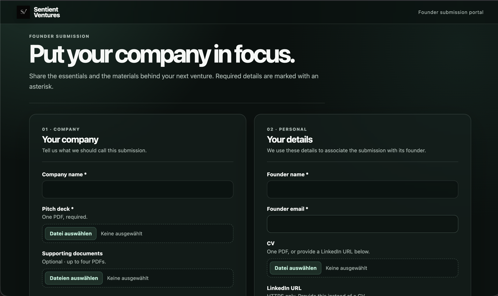
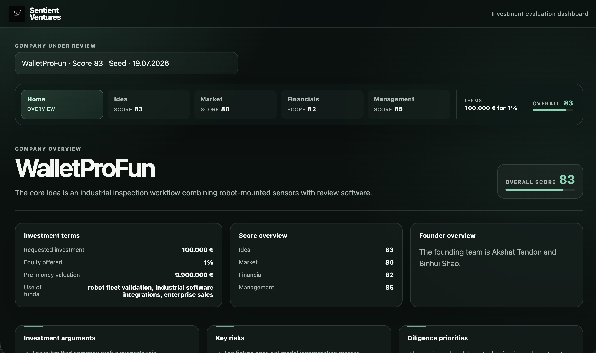

# SentientVentures

> **Next-Generation Startup Evaluation & Founder Background Analysis Platform**

SentientVentures is a powerful, locally-hosted platform designed to assist venture capitalists in evaluating early-stage startups. By combining pitch deck assessment, SQL database cross-referencing, and interactive network graphing, VCs can perform deep due diligence and verify founder background claims instantly.

---

## 📸 Preview & Screenshots

### 1. Founder Portal
Interface where founders submit their company information, pitch decks, and CVs.


### 2. Investor Portal (VC Dashboard)
VC evaluator view highlighting scorecards, structured criteria details, and database check verification statuses.


---

## 🚀 Key Features

* **Start-to-Finish Startup Evaluation**: Evaluates pitch decks, CVs, and company submissions across 75 distinct criteria spanning Management, Idea, Market, and Financials.
* **Database Founder Cross-Referencing**: Queries the SQL database `assets/DATABASE/hack_nation_people.sqlite` automatically to verify founder profiles, studies, and project links.
* **Academic Background Verification (Dual-State Inquiry)**:
  * **Verified (Disabled - Gray)**: Auto-disabled when the founder's academic credentials and university listed in the database match the claims made in the pitch deck.
  * **Send Inquiry (Enabled - Orange)**: Automatically alerts and activates when there is a mismatch (e.g. founder claims a Stanford/Oxford degree, but public records indicate Harvard/INSEAD), permitting VCs to send verification emails directly.
* **Founder Network Graph**: Reconstructs direct connection maps on the fly using **Python's `networkx`** on the backend and renders an interactive, physics-driven SVG graph on the frontend. Nodes represent:
  * **Founders** (green)
  * **Universities** (cyan)
  * **Projects** (gold)
  * **Hackathons** (orange)
  * **Alumni & Teammates** (silver)

---

## 🧠 LLM Council & OSINT Data Strategy

### 🗳️ The LLM Council Architecture
SentientVentures evaluates pitch decks and company profiles using a **multi-agent LLM Council**:
* **Parallel Jury Panel**: Rather than relying on a single prompt, a panel of specialized LLM judges evaluates the company across 75 structured criteria.
* **Source Attribution & Citation**: The council maps citations back to specific PDF document pages (e.g. pitch deck pages) to prevent hallucinations.
* **Deterministic Consensus**: An aggregator computes category scores and overall consensus metrics based on the jury's evaluations, generating a standardized report that is validated by the system.

### 🌐 OSINT & Database Expansion
The local SQLite database (`hack_nation_people.sqlite`) currently contains a relatively **limited seed database** of founders, alumni, and projects:
* **Extension via OSINT**: To reach full potential, the database can and should be expanded by integrating Open Source Intelligence (OSINT) scrapers.
* **Target Data Sources**: Automated pipelines can import public profiles from LinkedIn, GitHub commits, university graduation rosters, and public hackathon registries.
* **Verification Loop**: Augmenting the database directly improves the accuracy of background verification and provides VCs with a richer, more connected founder network graph.

---

## 🛠️ Architecture & Monorepo Components

SentientVentures is organized as a pnpm monorepo consisting of:

* **Founder Portal** (Port `8080`): Submission portal for founders to upload pitch decks, resumes, and enter company profiles.
* **VC Dashboard** (Port `8081`): The evaluator dashboard featuring structured evaluation categories, database integrations, and network graphs.
* **API Service** (Port `8000`): FastAPI backend handling PDF processing, metadata scoring, and SQLite directory queries.
* **Contracts Package**: Shared TypeScript contracts defining schemas and models between services.

---

## 📦 Getting Started

### Prerequisites

* **Conda** (for managing the Python environment)
* **Node.js** (v18+)
* **pnpm** (v9+)

### Installation & Launch

1. **Clone the repository and set up the Python Environment**:
   ```bash
   conda env create -f environment.yml
   conda activate codex-agents
   ```

2. **Install Node dependencies**:
   ```bash
   pnpm install
   ```

3. **Configure Environment Variables**:
   ```bash
   cp .env.example .env
   ```
   *Edit `.env` as required (e.g. adding LLM keys or customizing database paths).*

4. **Start the Monorepo services in development mode**:
   ```bash
   pnpm dev
   ```
   *This starts the API (8000), Founder Portal (8080), VC Dashboard (8081), and World Map (8082) concurrently.*

---

## 🗺️ Founder World Map (Port 8082)

An interactive, high-performance world map application is built on port `8082` using React and **Leaflet.js** (dark-themed tile layout):
- **Dynamic Circle Markers**: Visualizes all founders at their respective geocoordinates.
- **Score-Proportional Scaling**: The circle marker radius scales dynamically according to the founder's active founder score.
- **Direct VC Integration**: Clicking "View Profile" on any marker opens the VC Dashboard (`http://localhost:8081`) with a `?founder={id}` query parameter, which automatically displays the founder's profile modal.

---

## 🧪 Testing

We ensure robustness by validating changes across all components. Run the test suite:

```bash
pnpm typecheck                    # TypeScript syntax check
pnpm test:web                     # Frontend component and unit tests
pnpm test:contracts               # Shared contracts verification
conda run -n codex-agents pytest  # Backend API unit/integration tests
pnpm test:e2e                     # Playwright integration & navigation tests
```

---

## 📂 Additional Documentation

* 📝 [Architecture Guidelines](docs/architecture.md)
* ⚙️ [Operations & Deployment](docs/operations.md)
* 📜 [Markdown Evaluation Contracts](docs/markdown-contract.md)
